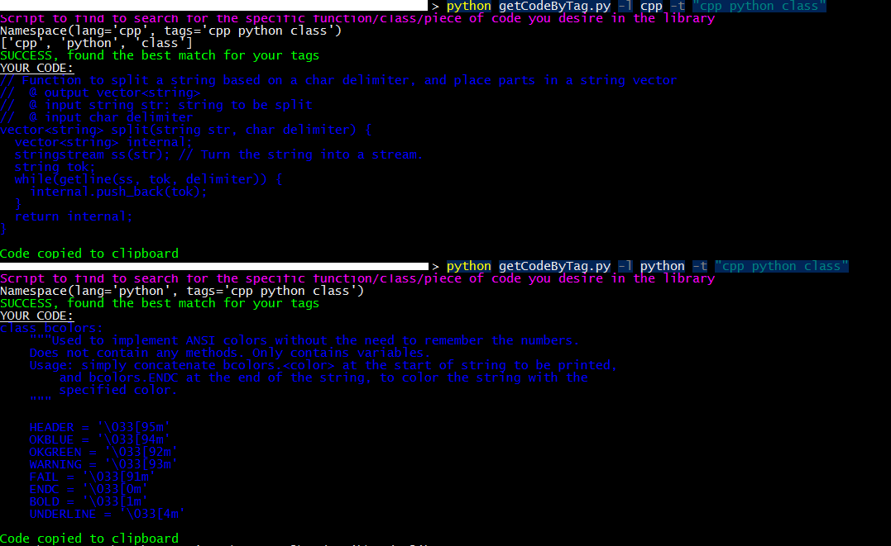

# code_lib
A code library, full of useful functions in various languages.

## Folder structure
 - lib
 - |--> *language*
 - |-- --> *function name*
 - |-- -- --> <*function name*>.<*file ext*>
 - |-- -- --> tags

lib contains all the code examples
the `tags` file in each folder is a space-separated list of tags relevant to the function/file in that folder

## Search function
`getCodeByTag.py` script uses the input language and string of tags to find the best match from the library (or the first closest match)

Example input and output of the script:

